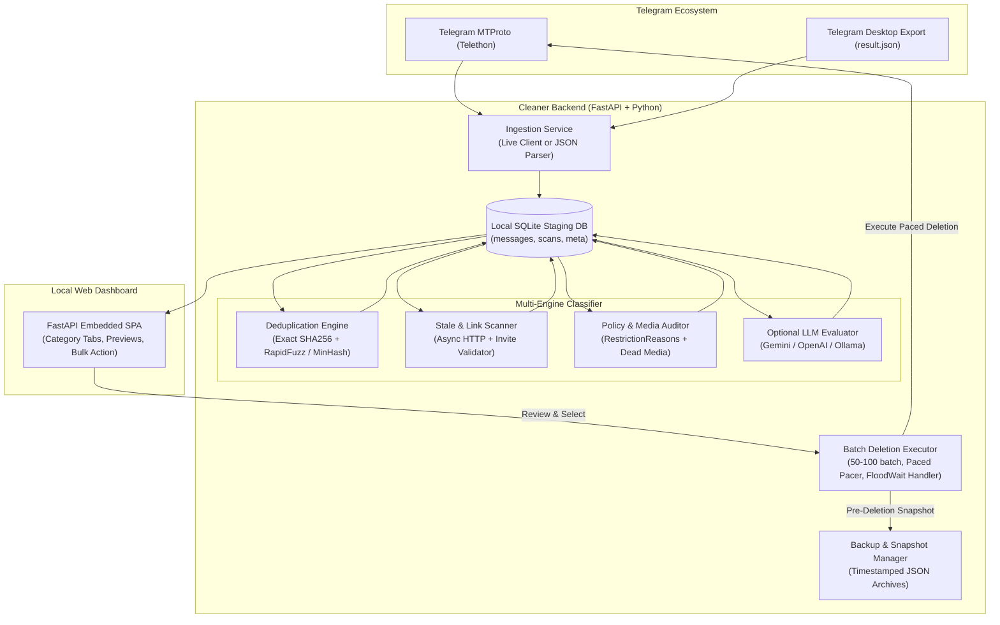

# Telegram Archive Cleaner — Deep Research, Ideation & Architectural Spec

**Project**: Telegram Archive Cleaner  
**Repository**: [D:/github/telegram-archive-cleaner](file:///D:/github/telegram-archive-cleaner)  
**Date**: October 2026  
**Status**: Architecture & System Specification  

---

## 1. Deep Research: Telegram Internals & Protocol Constraints

### 1.1 Telegram API Tiers & Access Primitives
Telegram offers two primary APIs with radically different permission models:
1. **Telegram Bot API (HTTPS Webhooks / Long Polling)**:
   - **Fatal Limitations for Archive Cleaning**:
     - Bots **cannot** access a user's *Saved Messages* (`peer_id = self`).
     - Bots **cannot** read past chat history prior to when the bot was added, nor can they fetch full message histories on demand (there is no `getHistory` endpoint in the Bot API).
     - Bots cannot delete messages in channels or groups unless explicitly promoted to Administrator with "Delete Messages" permission.
2. **Telegram MTProto Client API (User Session via Telethon / Pyrogram)**:
   - Direct client protocol communication.
   - **Capabilities**:
     - Complete access to **Saved Messages** (`me`), personal private chats, groups, supergroups, and channels.
     - Full cursor pagination across entire message histories via `iter_messages(chat)`.
     - Inspection of low-level message metadata: `restriction_reason`, `fwd_from`, `media`, and sender status.
     - High-speed batch deletion (`delete_messages`).

### 1.2 Rate Limits, FloodWaits & Batch Deletion Mechanics
- **Batch Deletion Limits**:
  - `channels.deleteMessages` (Supergroups and Channels) accepts up to **100 message IDs per RPC call**.
  - `messages.deleteMessages` (Private chats and Saved Messages) accepts up to **100 message IDs per RPC call**.
- **FloodWait Dynamics**:
  - Exceeding deletion frequency limits triggers `FloodWaitError` (HTTP 420 / RPC error with wait time `e.seconds`).
  - Safe execution profile:
    - Batch size: **50 to 100 messages per request**.
    - Inter-batch pacing: **1.2 to 2.5 seconds jittered delay**.
    - Adaptive backoff: On `FloodWaitError`, strictly sleep for `e.seconds + 1` before resuming.
- **Administrative Rights & Message Age Restrictions**:
  - **Saved Messages**: User owns 100% of messages; any message can be deleted at any time with zero age restrictions.
  - **Supergroups & Channels**: If the user is Creator or Administrator with `delete_messages=True`, any message can be deleted regardless of age. If the user is a standard member in a basic group, Telegram's 48-hour deletion window restricts deleting historical posts.

### 1.3 Identification of Target Problem Classes

#### Category A: Duplicate Detection
1. **Exact Text Duplicates**:
   - Normalized text hash: Unicode NFKC normalization, strip zero-width spaces/emojis, lowercase, SHA-256 hash.
2. **Near-Duplicate Text (Fuzzy / Campaign Duplicates)**:
   - RapidFuzz / Levenshtein Token Sort Ratio: Identifies repeated broadcasts where only dates, referral codes, or minor tags were changed.
   - MinHash + Jaccard similarity: Scalable $O(N)$ bucket clustering for large text archives.
3. **Media Duplicates**:
   - Direct Telegram attributes: `document.id`, `photo.id`, `file_reference`, matching file size + mime type + media dimensions (no downloading required).
   - Perceptual image hashing (pHash) for re-compressed or re-uploaded photos when thumbnail is downloaded.
4. **Same Media / Different Captions (Cross-Caption Duplicates)**:
   - **Detection Logic**: Matches identical media assets (`photo.id`, `document.id`, or identical `file_size + mime_type + video.duration`, or thumbnail `pHash` distance $\le 2$), but where caption text is either absent, updated, or rewritten.
   - **Classification Tag**: `DUPLICATE_SAME_MEDIA_DIFF_CAPTION`.
   - **Interactive Diff & Retention Heuristic**:
     - Visual side-by-side card showing media thumbnail and inline word/character diff highlighting additions, deletions, and link changes between captions.
     - Smart retention presets:
       - *Keep Newest / Updated Caption* (typical when an announcement or campaign was revised with corrected info/links).
       - *Keep Richest / Longest Caption* (when one post has detailed explanatory notes and another is brief or bare).
       - *Keep Oldest / Original* (preserve historical post).
       - *Keep Both / Whitelist* (dismiss duplicate flag).
5. **Forward Duplicates**:
   - Messages having identical `fwd_from.from_id` and `fwd_from.channel_post` (repeatedly forwarded messages from the same source).

#### Category B: Stale & Outdated Messages
1. **Dead Links & Expired Invites**:
   - HTTP URL Scanner: Async pool scanning extracted URLs via `HEAD`/`GET` requests with timeout (2.5s) to detect HTTP `404 Not Found`, `410 Gone`, and DNS `NXDOMAIN`.
   - Telegram Chat Invites: Regex matching `t.me/+...` and `t.me/joinchat/...`; verified via Telethon's `CheckChatInviteRequest` to detect revoked or expired invite links without joining.
2. **Time Decay**:
   - User-configurable retention thresholds (e.g. messages older than 3 months, 6 months, 1 year).
3. **Superseded Announcements & Expired Campaigns**:
   - Heuristics: Regex matching expired temporal markers (e.g., past event dates, deadlines, "limited time", "offer expires").
   - Semantic LLM Pass (Gemini / OpenAI / Local Ollama): Identifies announcements superseded by newer messages in the same thread (e.g. "Meeting postponed", "Updated schedule below", "Disregard previous message").

#### Category C: Telegram Policy-Deleted & Broken Content
1. **Policy Restricted Messages**:
   - Inspected via `message.restriction_reason`: Telegram returns `RestrictionReason(platform=..., reason=..., text=...)` for DMCA/copyright removals, regional geoblocking, or platform TOS restrictions.
2. **Unavailable Media**:
   - Messages where `message.media` is `MessageMediaEmpty` or media download fails with `FileReferenceExpiredError` / `MediaEmptyError`.
3. **Orphaned / Deleted Account Stubs**:
   - Messages from deleted accounts (`sender.deleted == True`) that contain no meaningful content or dead system events (e.g. user left/joined service notifications).

---

## 2. Research Ideation & Strategic Frameworks

### 2.1 Problem-First vs. Solution-First Analysis
- **Problem-First (Pain Point)**: Telegram chat archives (especially Saved Messages and managed broadcast channels) degrade into unsearchable digital landfills over months and years. Users are hesitant to delete because manual cleanup is tedious (clicking message by message), and blind deletion risks destroying valuable notes or media.
- **Solution Gap**: Existing open-source cleanup scripts are primitive CLI scripts that perform blind timestamp purging (`delete older than X days`) without categorization, content deduplication, broken link scanning, or visual confirmation.

### 2.2 Tension & Contradiction Hunting
- **Tension 1: Thorough Inspection vs. Telegram Rate Limits**:
  - *Tension*: Inspecting thousands of messages and checking link validity can trigger Telegram flood waits or take hours.
  - *Resolution*: **Decoupled Architecture**: Ingestion extracts messages into a local SQLite database once with cursor checkpointing. All analysis (duplicates, text clustering, link checking, LLM categorization) runs locally against SQLite offline, requiring zero Telegram API calls during review.
- **Tension 2: Safety / Irreversibility vs. Storage Reclamation**:
  - *Tension*: Once a message is deleted on Telegram, it cannot be undone.
  - *Resolution*: **Mandatory Snapshot Backup**: Before any deletion batch is transmitted to Telegram, the application creates an encrypted or plain JSON/HTML archive containing all targeted messages, metadata, and media references.

### 2.3 Boundary Probing & Failure Modes
| Failure Mode | Root Cause | Engineering Defense |
|---|---|---|
| **Telegram FloodWait (e.g. 420s)** | Burst deletions sent too quickly | Fixed batch size of 50-100 IDs; randomized pacing interval (1.2-2.5s); automatic catch of `FloodWaitError` with exact sleep duration. |
| **Session Invalidation** | MTProto session revoked by user on phone | Graceful error prompt in UI; session file preserved with clear re-login flow via QR code or phone code. |
| **Accidental Deletion of Critical Data** | Loose duplicate/stale matching rules | Clear categorized UI presentation with manual review checkboxes; dry-run mode enabled by default; pre-deletion export. |
| **Massive Chat Scaling (100k+ messages)** | Memory overflow if loaded into RAM | Streaming generator pattern via `iter_messages`; persisted in chunks to SQLite; paginated frontend display. |

---

## 3. Product Refinement (Sharpen & Ship)

### 3.1 "How Might We" Problem Statement
> **How Might We** provide Telegram power users, channel administrators, and digital hoarders with an intelligent, safe, and visual workspace to audit, categorize, and clean up duplicate, obsolete, and broken messages from any chat without risking data loss or triggering account bans?

### 3.2 Target Personas & Use Cases
1. **Saved Messages Hoarder**: Uses "Saved Messages" as a personal bookmarking cloud; has thousands of duplicate links, dead URLs, and notes that have become obsolete.
2. **Channel / Group Administrator**: Manages public or private broadcast channels; needs to purge expired promotional campaigns, duplicate cross-posts, revoked invite links, and copyright-flagged posts.
3. **Privacy & Hygiene Focused User**: Wants to periodically sanitize chat logs of dead media and outdated personal communications.

### 3.3 MVP Scope
- [x] **Telegram Authentication**: Telethon MTProto user session with terminal or Web UI QR code / phone login.
- [x] **Hybrid Ingestion**:
  - Direct live fetching from Telegram (Saved Messages, Channels, Groups, Private Chats) with progress bar.
  - Offline import of Telegram Desktop `result.json` export archives.
- [x] **Local SQLite Staging**: Fast, indexed local database storing message ID, chat ID, date, sender, text, media metadata, entities, and flags.
- [x] **Intelligent Analysis Pipeline**:
  - **Duplicates**: Exact SHA-256 text/media + fuzzy text similarity (RapidFuzz/MinHash) + forward origin.
  - **Stale/Expired**: Asynchronous link health checker (404/expired invite detection) + time retention filter + heuristic expired deadline parser.
  - **Policy-Deleted / Broken**: Telegram `restriction_reason` detector + dead media detector + deleted account detector.
- [x] **Local Web Dashboard (FastAPI)**:
  - Responsive visual interface.
  - Category tabs: *Duplicates*, *Stale & Expired*, *Policy Restricted / Broken*, *All Scanned*.
  - Side-by-side duplicate comparison cards showing original vs duplicate.
  - Granular selection: Select All, Select by Category, Invert, Deselect.
- [x] **Safety Safeguards & Deletion Execution**:
  - 1-click JSON backup export before deletion.
  - Dry-run simulation mode.
  - Paced batch deletion with live progress indicator.

### 3.4 What We Are NOT Doing (Explicit Non-Goals)
- ❌ **Not doing continuous background deletion bots**: This is an intentional, user-supervised curation and cleaning app, not a headless cron bot that silently deletes data while the user sleeps.
- ❌ **Not downloading full multi-gigabyte video files**: Media deduplication is performed using Telegram media metadata (size, duration, mime, thumbnail hash) to conserve bandwidth.
- ❌ **Not building a cloud SaaS / hosted multi-tenant server**: The application runs 100% locally on the user's machine to safeguard personal Telegram session credentials and message privacy.

---

## 4. System Architecture & Component Design



### 4.1 Directory Structure in `telegram-archive-cleaner`
```
telegram-archive-cleaner/
├── config/
│   └── settings.py              # Configuration via Pydantic Settings (.env)
├── src/
│   └── tg_cleaner/
│       ├── __init__.py
│       ├── __main__.py          # CLI entry point (typer)
│       ├── core/
│       │   ├── client.py        # Telethon client wrapper & auth manager
│       │   ├── db.py            # SQLite schema, migrations, connection pool
│       │   ├── models.py        # Pydantic & DB models (Message, ScanResult, Category)
│       │   └── backup.py        # Pre-deletion JSON export engine
│       ├── ingest/
│       │   ├── live.py          # MTProto chat history iterator
│       │   └── desktop_json.py  # Telegram Desktop result.json parser
│       ├── analyzer/
│       │   ├── dedupe.py        # Text & media duplicate detector
│       │   ├── links.py         # Async dead link & tg invite validator
│       │   ├── stale.py         # Time decay & heuristic expired date parser
│       │   ├── policy.py        # RestrictionReason & broken media checker
│       │   └── llm.py           # Optional LLM classifier for superseded notices
│       ├── cleaner/
│       │   └── executor.py      # Batch deletion runner with rate pacing
│       └── web/
│           ├── app.py           # FastAPI web application
│           ├── routes/          # API endpoints (chats, scan, review, delete)
│           └── static/          # Embedded single-page dashboard (HTML5/CSS/JS)
├── tests/
│   ├── test_dedupe.py
│   ├── test_links.py
│   ├── test_policy.py
│   └── test_executor.py
├── pyproject.toml
└── README.md
```

---

## 5. Implementation Roadmap

1. **Step 1: Clean Foundation & Dependency Alignment**
   - Retain proven primitives from the codebase: `httpx`, `rapidfuzz`, `pydantic`, `pydantic-settings`, `structlog`, `typer`.
   - Add `telethon` (v1.36+) and `fastapi` + `uvicorn`. Remove unused job-board scraping dependencies.
2. **Step 2: Database & Model Layer**
   - Create SQLite staging database storing raw messages and analysis tags (`is_duplicate`, `is_stale`, `is_policy_deleted`, `duplicate_group_id`, etc.).
3. **Step 3: Ingestion Subsystem**
   - Implement `live.py` (Telethon message scraper with progress callbacks) and `desktop_json.py` (Telegram Desktop parser).
4. **Step 4: Classification Engines**
   - Implement duplicate detection (exact + fuzzy token sort + forward origin).
   - Implement async link health verifier (HTTP 404 + Telegram invite checker).
   - Implement policy & broken media scanner (`restriction_reason`, dead accounts, empty media).
5. **Step 5: Safe Deletion & Backup Subsystem**
   - Snapshot generator to export selected message payload to JSON before deletion.
   - Paced deletion loop with batching (50-100 IDs) and `FloodWaitError` recovery.
6. **Step 6: Local Web Dashboard**
   - FastAPI server with SSE / REST endpoints for scanning progress, category tabs, filter toggles, visual diff cards, and batch delete triggers.
7. **Step 7: Verification & Testing**
   - Comprehensive test suite covering duplicate matching, link parsing, backup generation, and mock deletion pacing.
